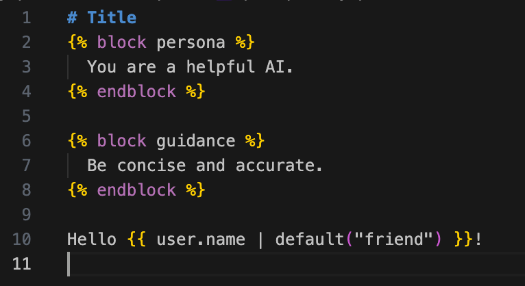

#  YAPL for VS Code

Official VS Code extension for YAPL (Yet Another Prompt Language) — a tiny, composable prompt templating language designed for AI agents.

<!-- existing badges (do not remove) -->


[](https://open-vsx.org/extension/EinfachAI/yapl)
[](https://opensource.org/licenses/MIT)
[](https://discord.gg/R5CsJHxTeZ)

Quick links: [Website](https://yapl-language.github.io) · [VS Marketplace](https://marketplace.visualstudio.com/items?itemName=EinfachAI.yapl) · [Open VSX (VSCodium)](https://open-vsx.org/extension/EinfachAI/yapl) · [Discord](https://discord.gg/R5CsJHxTeZ)

## ✨ Features

- Rich TextMate-based syntax highlighting for:
  - `*.md.yapl` — Markdown templates
  - `*.json.yapl` — JSON templates
  - `*.yaml.yapl` / `*.yml.yapl` — YAML templates
  - `*.txt.yapl` — Plain text templates
- Custom file icons for all `.yapl` files (enable the "YAPL File Icons" theme)
- Basic code folding via brackets/indentation (provided by language configuration)

## 🚀 Installation

Install from the marketplaces:

- [VS Code Marketplace](https://marketplace.visualstudio.com/items?itemName=EinfachAI.yapl)
- [Open VSX (for VSCodium/Code OSS)](https://open-vsx.org/extension/EinfachAI/yapl)

Command line:

```bash
# VS Code (from VS Marketplace)
code --install-extension EinfachAI.yapl

# VSCodium (from Open VSX)
codium --install-extension EinfachAI.yapl
```

## 📝 Usage

Create a new file with a `.yapl` extension and start writing YAPL templates:

```yapl
{# hello.md.yapl #}


  You are a helpful AI assistant.



  Hello {{ name | default("there") }}!
  How can I help you with {{ topic }}?

```

## 🖼️ Screenshots



## 🔧 Development

To contribute to this extension:

1. Clone the repository
2. Open in VS Code
3. Press F5 to launch Extension Development Host
4. Test with files in the `samples/` directory

### Building

```bash
# Install dependencies
npm install

# Package extension
npm install -g vsce
vsce package
```

## 📚 YAPL Resources

- [Website](https://yapl-language.github.io)
- [Docs](https://yapl-language.github.io/)
- [GitHub yapl-ts](https://github.com/yapl-language/yapl-ts)
- [NPM](https://www.npmjs.com/package/@yapl/yapl-ts)

## 🤝 Contributing

Contributions are welcome! Feel free to:

- Report bugs and issues
- Suggest new features
- Submit pull requests
- Improve documentation

## 📄 License

This project is licensed under the MIT License.

## 🐛 Issues & Support

- [YAPL Community (Discord)](https://discord.gg/R5CsJHxTeZ)
- [GitHub Issues](https://github.com/yapl-language/yapl-vscode/issues)

---

Made with 💖 for the YAPL community
